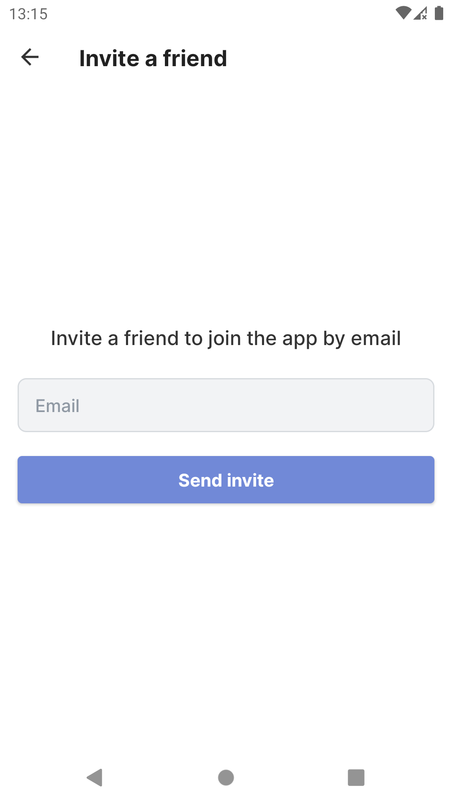

# Chat

Android messaging app written in Kotlin that features user login/registration and the ability to add
friends.

## Built with

- [Kotlin](https://kotlinlang.org/) - First class and official programming language for Android
  development.
- [Coroutines](https://kotlinlang.org/docs/reference/coroutines-overview.html) - For asynchronous
  and more..
- [Android Architecture Components](https://developer.android.com/topic/libraries/architecture) -
  Collection of libraries that help you design robust, testable, and maintainable apps.
    - [LiveData](https://developer.android.com/topic/libraries/architecture/livedata) - Data objects
      that notify views when the underlying database changes.
    - [ViewModel](https://developer.android.com/topic/libraries/architecture/viewmodel) - Stores
      UI-related data that isn't destroyed on UI changes.
    - [ViewBinding](https://developer.android.com/topic/libraries/view-binding) - Generates a
      binding class for each XML layout file present in that module and allows you to more easily
      write code that interacts with views.
    - [Navigation component](https://developer.android.com/guide/navigation) - Fragment routing
      handler.
    - [Room](https://developer.android.com/topic/libraries/architecture/room) - SQLite object
      mapping library.
- [Toothpick](https://github.com/stephanenicolas/toothpick) - Dependency Injection library.
- [OkHttp3](https://github.com/square/okhttp) - For implementing interceptor, logging and mocking
  web server.
- [Glide](https://github.com/bumptech/glide) - An image loading and caching library for Android
  focused on smooth scrolling.
- [Retrofit](https://square.github.io/retrofit/) - A type-safe HTTP client for Android and Java.

## Screenshots

